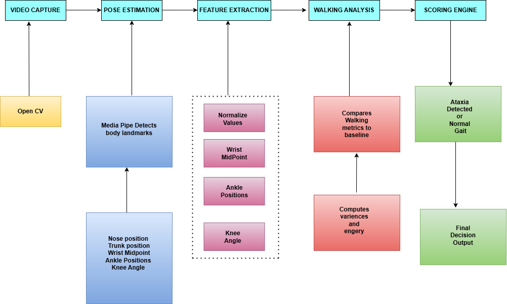

# Automated Rehabilitation Feedback for Cerebellar Ataxia

**Automated Rehabilitation Feedback System** is an AI-powered solution that uses **computer vision and pose estimation** to analyze gait patterns of patients with cerebellar ataxia and provide real-time feedback.

---

##  Why This Project?

Traditional rehabilitation requires constant clinical supervision. This system solves that by:

-  Real-time movement tracking using webcam  
-  AI-based pose estimation (BlazePose)  
-  Automated gait analysis and scoring  
-  Enables home-based rehabilitation  

---

## Project Workflow

---

## Outputs

- ** Gait Analysis Graph**
- 

 
 
- 
---
